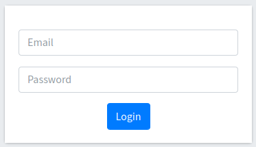
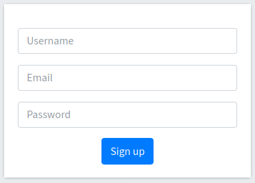

Chào mọi người, hôm nay chúng ta hãy cùng nhau tìm hiểu về Authentication 2.0 trong Framework CakePHP 4 nhé!
###I. Cài đặt Authentication 2.0
Cài đặt plugin với composer từ thư mục ROOT của Dự án CakePHP của bạn (nơi chứa tệp **composer.json** ).
```bash
    composer require cakephp/authentication:^2.0
```
Tải plugin authentication bằng cách thêm câu lệnh sau vào dự án của bạn trong `src/Application.php`:
```php
    /**
     * Bootstrap method.
     *
     * @return void
     */
    public function bootstrap(): void
    {
        parent::bootstrap();
        $this->addPlugin('Authentication');
    }
```
###II. Cấu hình và sử dụng Authentication để xác thực người dùng
Plugin authentication được tích hợp trong dự án với vai trò như một middleware hay một component để giúp việc xác thực người dùng dễ dàng hơn. Đầu tiên, áp dụng nó như một middleware, thêm vào `src/Application.php` một số lớp cần thiết:
```php
    use Authentication\AuthenticationService;
    use Authentication\AuthenticationServiceInterface;
    use Authentication\AuthenticationServiceProviderInterface;
    use Authentication\Identifier\IdentifierInterface;
    use Authentication\Middleware\AuthenticationMiddleware;
    use Cake\Http\MiddlewareQueue;
    use Psr\Http\Message\ServerRequestInterface;
```
Tiếp theo, implements `AuthenticationProviderInterface`vào lớp `Application`:
```php
    class Application extends BaseApplication implements AuthenticationServiceProviderInterface
```
Sau đó, thêm middleware `AuthenticationMiddleware`vào trong phương thức `middleware()` . Hãy chắc chắn đã thêm `AuthenticationMiddleware `trước `AuthorizationMiddleware`nếu bạn dùng cả hai plugin này.
```php
    $middleware->add(new AuthenticationMiddleware($this))
```
Thêm phương thức `getAuthenticationService` vào `src / Application.php`.  Phương thức này sẽ cấu hình cơ bản các tác vụ xác thực của bạn với Authentication.
```php
    /**
     * Get authenticationService.
     *
     * @param \Psr\Http\Message\ServerRequestInterface $request Request.
     * @return \Authentication\AuthenticationServiceInterface
     */
    public function getAuthenticationService(ServerRequestInterface $request): AuthenticationServiceInterface
    {
        $service = new AuthenticationService();
        // Define where users should be redirected to when they are not authenticated
        $service->setConfig([
            'unauthenticatedRedirect' => '/users/login',
            'queryParam' => 'redirect',
        ]);
        $fields = [
            IdentifierInterface::CREDENTIAL_USERNAME => 'email',
            IdentifierInterface::CREDENTIAL_PASSWORD => 'password'
        ];
        // Load the authenticators. Session should be first.
        $service->loadAuthenticator('Authentication.Session');
        $service->loadAuthenticator('Authentication.Form', [
            'fields' => $fields,
            'loginUrl' => '/users/login'
        ]);
        // Load identifiers
        $service->loadIdentifier('Authentication.Password', compact('fields'));
    
        return $service;
    }
```
Đầu tiên, cấu hình những việc cần làm với người dùng khi họ chưa được xác thực bằng `setConfig()`. Tiếp theo, đính kèm `Session` và  `Form` vào authentication  xác định các cơ chế mà ứng dụng sẽ sử dụng để xác thực người dùng. `Session`cho phép xác định người dùng dựa trên dữ liệu trong phiên và xác định thời gian người dùng được giữ đăng nhập trong khi `Form`cho phép xử lý biểu mẫu đăng nhập tại `loginUrl`. Cuối cùng, hãy đính kèm một số `identifier` để chuyển đổi thông tin đăng nhập mà người dùng sẽ cung cấp cho thành một `identity` đại diện cho người dùng đã đăng nhập.
Tiếp theo, tải authentication component trong `src/Controller/AppController`.
```php
    /**
     * Initialize method.
     * 
     * @return void
     */
    public function initialize(): void
    {
        parent::initialize();
        $this->loadComponent('Authentication.Authentication');
    }
```
Theo mặc định, component sẽ yêu cầu một người dùng phải xác thực cho **tất cả các** hành động. Có thể vô hiệu hóa hành vi này trong các controller cụ thể bằng cách sử dụng `allowUnauthenticated()`:
```php
    $this->Authentication->allowUnauthenticated(['view', 'index']);
```
Ví dụ trên sẽ giúp bỏ qua xác thực người dùng đối với các phương thức `view` và `index` trong controller.
Theo mặc định authentication sẽ sử dụng model của bảng `Users` trong database để lấy dữ liệu và tiến hành xác thực. Tuy nhiên bạn cũng có thể lựa chọn một model khác để thực hiện việc này bằng cách sử dụng `userModel`.
```php
    $service->loadIdentifier('Authentication.Password', [  
          'fields' => [  
		      'username' => 'email',  
		      'password' => 'password',  
		  ],  
          'resolver' => [  
	          'className' => 'Authentication.Orm',  
	          'userModel' => 'Admins',  
          ],  
    ]);
```   
###III. Thử tạo chức năng đăng nhập và mã hóa mật khẩu

Khi đã áp dụng middleware authentication, người dùng sẽ cần phải đăng nhập để sử dụng các tác vụ của ứng dụng. Trước tiên, tạo model và controller Users với command của cakephp:
```bash
    bin/cake bake model Users 
    bin/cake bake controller Users
```
Sau đó, thêm một phương thức đăng nhập cơ bản vào controller `UsersController`. Nó sẽ giống như:
```php
    /**
     * Login method.
     *
     * @return void
     */
    public function login()
    {
        $result = $this->Authentication->getResult();
        if ($result->isValid()) {
            $target = $this->Authentication->getLoginRedirect() ?? '/home';
            return $this->redirect($target);
        }
        if ($this->request->is('post') && !$result->isValid()) {
            $this->Flash->error('Invalid username or password');
        }
    }
```
Đảm bảo rằng phương thức `login` đã được cho phép truy cập trong bất kì điều kiện nào để người dùng chưa được xác thực có thể truy cập nó.
```php
    /**
     * Method beforeFilter.
     *
     * @return void
     */
    public function beforeFilter(\Cake\Event\EventInterface $event): void
    {
        parent::beforeFilter($event);
    
        $this->Authentication->allowUnauthenticated(['login']);
    }
```
Bây giờ, chúng ta có thể tạo một template đăng nhập đơn giản trong `templates\Users\login.php` để thử chức năng đăng nhập.
```php
    <div class="users form content">
	  <?= $this->Form->create() ?>
	  <?= $this->Form->control('email') ?>
      <?= $this->Form->control('password') ?>
      <?= $this->Form->button(__('Login')); ?>
      <?= $this->Form->end() ?>
    </div>
```   
   
   
Sau đó, thêm một hành động đăng xuất đơn giản để người dùng có thể đăng xuất ra khỏi ứng dụng trong `UsersController`:
```php
    /**
     * Logout method.
     *
     * @return void
     */
    public function logout()
    {
        $this->Authentication->logout();
        return $this->redirect(['controller' => 'Users', 'action' => 'login']);
    }
```    
Để đăng nhập, người dùng sẽ cần phải có mật khẩu đã được mã hóa và lưu trong database. Có thể tự động mã hóa mật khẩu khi người dùng cập nhật mật khẩu của họ bằng phương thức `_setPassword` mà authentication hỗ trợ được thêm vào `Entity`:
```php
    use Authentication\PasswordHasher\DefaultPasswordHasher;
    
    class User extends Entity
    {
        /**
         * Set password.
         *
         * @param string $password Password.
         * @return string
         */
        protected function _setPassword(string $password)
        {
            $hasher = new DefaultPasswordHasher();
            return $hasher->hash($password);
        }
    }
```    
Giờ chỉ cần tạo một phương thức đăng ký đơn giản và đăng ký một tài khoản là có thể thử nghiệm chức năng đăng nhập, đăng xuất với `Authentication` rồi. 
Ví dụ template cho việc đăng kí trong `templates\User\sign_up.php`:
```php
    <?= $this->Form->create($user) ?>
    <?= $this->Form->control('username') ?>
    <?= $this->Form->control('email') ?>
    <?= $this->Form->control('password') ?>
    <?= $this->Form->button(__('Sign up')) ?>
    <?= $this->Form->end() ?>
```   
   
###IV. Kết luận

Việc sử dụng Authentication để thực hiện các chức năng đăng nhập, đăng xuất là điều khá cơ bản và dễ dàng. CakePHP cũng hỗ trợ nhiều các phương thức đăng nhập nâng cao khác như xác thực với token, jwt, ...Chúng ta sẽ tìm hiểu về những phương thức này trong các blog sắp tới nhé!

######                    *<div style="text-align: right"> - [Phu Thai | Đồng Phú Thái] </div>*